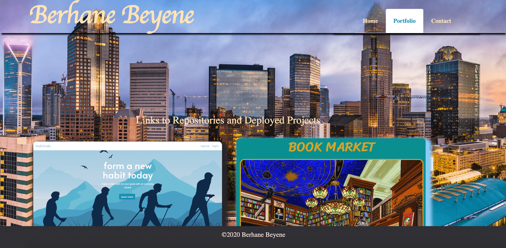
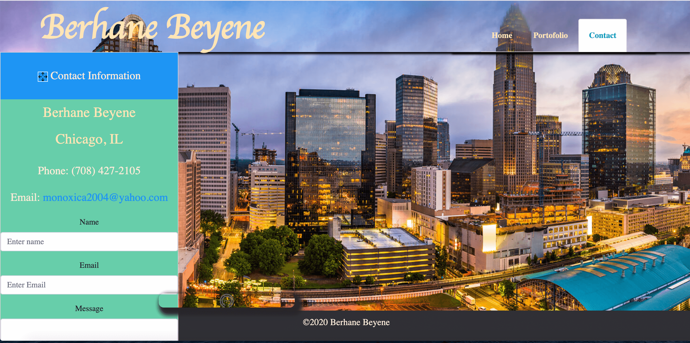

# react-portfolio

  ## Table of Contents
   * [Description](#Description)
   

   * [Installation and Usage](#installation-and-usage-instructions)
   
   * [Deployed Images](#Deployed-Images)
   
   * [Contribution](#Contribution)
   
   * [Developers Contact Information](#Developers-Contact-Information)
     
  * [License](#license)

## Description
 
   1. `index.js` is file responsible for rendering the app into the public index.html.
   2. `App.js` is file returns a single div with the body wraped in it.
   3. `utils/API.js` is retrives the json data from using axios. 
   4. `components` folder is the main body of the aplication where the diferent jsx files are developed, exported and inported as needed.
 

   ## Installation and Usage Instructions
   [react-portfolio](https://github.com/Bbeyenene/react-portfolio). 

   ## Deployed Images
  1. The home page is loaded with my Image and information about me. 

2. The portfolio page is the location where links to github, linkdin and my resume. Moreover, images of my projects are added and on click to the images will take you to the functional url of the profect.

3. The contact page have my contact information.

   
   ## Contribution
   [Bbeyenene](https://github.com/Bbeyenene) is the only contrubuter to this project.
   
   ## Developers Contact Information
   * LinkdIn Profile: [Berhane](https://www.linkedin.com/in/berhane-beyene/)
   * Deployed URL : [react-portfolio](https://https://bm1portfolio.herokuapp.com/) 
   * Email: monoxica2004@yahoo.com
   ## License
   This application is licensed under .
